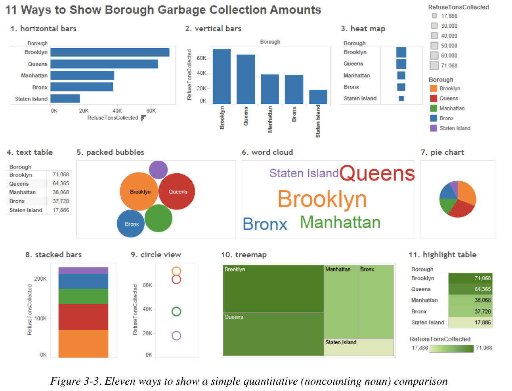

```{r setup, include=FALSE}
knitr::opts_chunk$set(echo = T,include=T,warning=F,message=F,tidy=F)
```

## Introduction

- In this section, we are going to be learning about existing methods which help us visually communicate, "How Much?"

\vskip 0.10 in

- "How much?" types of visualizations make use of quantitative variables, which are \textit{measured} like:
    - "How much money did we earn this past quarter?"
    - "How much carbon dioxide is in the atmosphere?"
    - "How much time do undergraduate students in Georgia spend on social media sites per day?"
    
\vskip 0.10 in

- In this section, we are doing to focus on answering "How Much?" types of questions using a single (or univariate) quantitative variable.

## Communicating "How Much"

- Quantitative variables which are measured are things like revenue, weight, distance, and time, among many, many others.

\vskip 0.10 in

- Generally, here, our data source would need to be in aggregate form, so that a single record exists. For instance:
    - A sales order generating revenues of \$95
    - A shipment weighing 5.2 pounds
    - A flight covering a distance of 2,408 miles
    
## Communicating "How Much"

- Let's check out an example of this using the NYC Garbage Data.

\vskip 0.10 in

- These data represent the amount of garbage (the less fancy term for "refuse"), in tons, collected each month of the year, in each of the boroughs and community districts in the city.

\vskip 0.10 in

- Suppose we wanted to know, "How does the amount of garbage/refuse (in tons) that the NYC Department of Sanitation reportedly collected from each borough compare during September 2011?"
    - Let's see how we can accomplish this!
    
## Communicating "How Much"

- First, we have to subset the data to our specific time parameters (September 2011). Don't worry about the warning message.

```{r}
library(tidyverse)
## To answer this question, let's first read in the data ##
nyc <- readxl::read_xlsx("NYC Trash Data.xlsx")
## Subset to September 2011 ##
nyc_sept11 <- nyc |>
  dplyr::filter(MONTH == 9 & YEAR == 2011)
## Sum up REFUSETONSCOLLECTED variable by Borough ##
trash_tot <- nyc_sept11 |>
  dplyr::group_by(BOROUGH) |>
  dplyr::summarize(Sum_Trash = sum(REFUSETONSCOLLECTED))
```

## Communicating "How Much"

```{r}
trash_tot
```

## Communicating "How Much"

- Now, how do we go about visualizing these data? There are lots of ways we can do so using \texttt{ggplot2}. Here are just a few:

```{r,echo=F,fig.align='center',out.width="65%",out.height="70%"}

```

## Communicating "How Much": The Vertical Bar Chart

- Let's start by building a vertical bar chart.

```{r,eval=F}
## Let's start by building a vertical bar chart! ##

## To do so, we will use the geom_bar function ##

trash_tot |>
  ggplot(aes(x=BOROUGH,y=Sum_Trash)) +
  geom_bar(stat='identity')
```

## Communicating "How Much": The Vertical Bar Chart

```{r,echo=F}
trash_tot |>
  ggplot(aes(x=BOROUGH,y=Sum_Trash)) +
  geom_bar(stat='identity')
```

## Communicating "How Much": The Vertical Bar Chart

- Great! We have a visualization to compare "how much?" But what are some ways we could improve this visualization?

\vskip 0.10 in

- You'll notice that by default, \texttt{ggplot2} orders the bars alphabetically. It might be better to order them by value (i.e., most to least) for the comparison to be more effective.
    - We also aren't effectively labeling things!

\vskip 0.10 in

- Let's see try to solve these problems using \texttt{reorder} as well as \texttt{labs}!

## Communicating "How Much": The Vertical Bar Chart

```{r,eval=F}
## Solving the Labels Problem ##
trash_tot |>
  ggplot(aes(x=BOROUGH,y=Sum_Trash)) +
  geom_bar(stat='identity') +
  labs(x = "NYC Borough",
       y = "Total Refuse Collected (in tons)",
       title = "Trash Collectd in NYC by Borough",
       subtitle = "September 2011")
```

## Communicating "How Much": The Vertical Bar Chart

```{r}
trash_tot |>
  ggplot(aes(x=BOROUGH,y=Sum_Trash)) +
  geom_bar(stat='identity') +
  labs(x = "NYC Borough",
       y = "Total Refuse Collected (in tons)",
       title = "Trash Collectd in NYC by Borough",
       subtitle = "September 2011") 
```

## Communicating "How Much": The Horizontal Bar Chart

```{r,eval=F}
## Solving the Colors Problem ##
trash_tot |>
  ggplot(aes(x=BOROUGH,y=Sum_Trash)) +
  geom_bar(stat='identity',color='black',fill='white') +
  labs(x = "NYC Borough",
       y = "Total Refuse Collected (in tons)",
       title = "Trash Collectd in NYC by Borough",
       subtitle = "September 2011") +
  theme_classic()
```

## Communicating "How Much": The Horizontal Bar Chart

```{r,echo=F}
## Solving the Colors Problem ##
trash_tot |>
  ggplot(aes(x=BOROUGH,y=Sum_Trash)) +
  geom_bar(stat='identity',color='black',fill='white') +
  labs(x = "NYC Borough",
       y = "Total Refuse Collected (in tons)",
       title = "Trash Collectd in NYC by Borough",
       subtitle = "September 2011") +
  theme_classic()
```

## Communicating "How Much": The Horizontal Bar Chart

```{r,eval=F}
## Solving the Ordering Problem ##
trash_tot |>
  ggplot(aes(x=reorder(BOROUGH,-Sum_Trash),y=Sum_Trash)) +
  geom_bar(stat='identity',color='black',fill='white') +
  labs(x = "NYC Borough",
       y = "Total Refuse Collected (in tons)",
       title = "Trash Collectd in NYC by Borough",
       subtitle = "September 2011") +
  theme_classic()
```

## Communicating "How Much": The Horizontal Bar Chart

```{r,echo=F}
## Solving the Ordering Problem ##
trash_tot |>
  ggplot(aes(x=reorder(BOROUGH,-Sum_Trash),y=Sum_Trash)) +
  geom_bar(stat='identity',color='black',fill='white') +
  labs(x = "NYC Borough",
       y = "Total Refuse Collected (in tons)",
       title = "Trash Collectd in NYC by Borough",
       subtitle = "September 2011") +
  theme_classic()
```

## Communicating "How Much": The Horizontal Bar Chart

- While the exact same data are being communicated in both visualizations, the second allows us to much more quickly not only make comparisons, but get an understanding of the order.

\vskip 0.10 in

- One other modification which may also make the visualization more effective is for the bars to be made \textit{horizontal} rather than \textit{vertical}.

\vskip 0.10 in

- We change the x and y global aesthetics to achieve this.

## Communicating "How Much": The Horizontal Bar Chart

```{r,eval=F}
trash_tot |>
  ggplot(aes(x=Sum_Trash,y=reorder(BOROUGH,Sum_Trash))) +
  geom_bar(stat='identity',color='black',fill='white') +
  labs(x = "NYC Borough",
       y = "Total Refuse Collected (in tons)",
       title = "Trash Collectd in NYC by Borough",
       subtitle = "September 2011") +
  theme_classic()
```

## Communicating "How Much": The Horizontal Bar Chart

```{r,echo=F}
trash_tot |>
  ggplot(aes(x=Sum_Trash,y=reorder(BOROUGH,Sum_Trash))) +
  geom_bar(stat='identity',color='black',fill='white') +
  labs(x = "NYC Borough",
       y = "Total Refuse Collected (in tons)",
       title = "Trash Collectd in NYC by Borough",
       subtitle = "September 2011") +
  theme_classic()
```

## Communicating "How Much": The Dot Chart

- The ordered vertical and horizontal bar charts are really useful tools for comparing "how much" but certainly they aren't the only tools.

\vskip 0.10 in

- Another tool, called the "dot chart" is sometimes preferred to the two methods previously discussed seeing as the eye may be overwhelmed by the bars. We are really just comparing values.
    - In essence, we only need the "top" of the bars, not the whole thing.
    
\vskip 0.10 in

- Using the basic \texttt{ggplot2} syntax we have already developed, we can easily change our bar charts to dot charts:

## Communicating "How Much": The Dot Chart

```{r,eval=F}
trash_tot |>
  ggplot(aes(x=reorder(BOROUGH,-Sum_Trash),y=Sum_Trash)) +
  geom_point(color='blue',fill='blue') +
  labs(x = "NYC Borough",
       y = "Total Refuse Collected (in tons)",
       title = "Trash Collectd in NYC by Borough",
       subtitle = "September 2011") +
  theme_classic()
```

## Communicating "How Much": The Dot Chart

```{r,echo=F}
trash_tot |>
  ggplot(aes(x=reorder(BOROUGH,-Sum_Trash),y=Sum_Trash)) +
  geom_point(color='blue',fill='blue') +
  labs(x = "NYC Borough",
       y = "Total Refuse Collected (in tons)",
       title = "Trash Collectd in NYC by Borough",
       subtitle = "September 2011") +
  theme_classic()
```

## Communicating "How Much": The Dot Chart

- Notice something about these dots...they're tiny! How can we control the size of the dots?

\vskip 0.10 in

- We can make use of the \texttt{size} argument within the \texttt{geom\_point} function.

\vskip 0.10 in

- The default value is 1.5. We can increase or decrease this value based on our needs! Let's try \texttt{size=3}.

```{r,eval=F}
trash_tot |>
  ggplot(aes(x=reorder(BOROUGH,-Sum_Trash),y=Sum_Trash)) +
  geom_point(color='blue',fill='blue',size=3) +
  labs(x="NYC Borough",
       y="Total Refuse Collected (in tons)",
       title="Trash Collected in NYC by Borough",
       subtitle="September 2011") +
  theme_classic()
```

## Communicating "How Much": The Dot Chart

```{r,echo=F}
trash_tot |>
  ggplot(aes(x=reorder(BOROUGH,-Sum_Trash),y=Sum_Trash)) +
  geom_point(color='blue',fill='blue',size=3) +
  labs(x="NYC Borough",
       y="Total Refuse Collected (in tons)",
       title="Trash Collected in NYC by Borough",
       subtitle="September 2011") +
  theme_classic()
```

## Communicating "How Much": The Dot Chart

- Better! Let's flip the coordinates as before to create a horizontal dot chart (notice I once again removed the "-" symbol from the \texttt{reorder} function so the dots render in descending rather than ascending order):

```{r,eval=F}
trash_tot |>
  ggplot(aes(x=Sum_Trash,y=reorder(BOROUGH,Sum_Trash))) +
  geom_point(color='blue',fill='blue',size=3) +
  labs(x="NYC Borough",
       y="Total Refuse Collected (in tons)",
       title="Trash Collected in NYC by Borough",
       subtitle="September 2011") +
  theme_classic()
```

## Communicating "How Much": The Dot Chart

```{r,echo=F}
trash_tot |>
  ggplot(aes(x=Sum_Trash,y=reorder(BOROUGH,Sum_Trash))) +
  geom_point(color='blue',fill='blue',size=3) +
  labs(x="NYC Borough",
       y="Total Refuse Collected (in tons)",
       title="Trash Collected in NYC by Borough",
       subtitle="September 2011") +
  theme_classic()
```

## Communicating "How Much": The Dot Chart

- One potential limitation of the dot chart, as it stands, is that even though we only care about the dots themselves, the eye may need help in moving from the y-axis to the dot, especially when the values associated with the dots are large (in a relative sense)

\vskip 0.10 in

- Instead of including a whole bar, what if we included just a dashed line going from the borough name to the dot?

\vskip 0.10 in

- To do this, we are going to make use of the \texttt{theme} function, which controls many, many aspects of the visualization including font, label justification, and tick marks, just to name a few.

## Communicating "How Much": The Dot Chart

```{r,eval=F}
trash_tot |>
  ggplot(aes(x=Sum_Trash,y=reorder(BOROUGH,Sum_Trash))) +
  geom_point(color='blue',fill='blue',size=3) +
  labs(x="NYC Borough",
       y="Total Refuse Collected (in tons)",
       title="Trash Collected in NYC by Borough",
       subtitle="September 2011") +
  theme_classic() + 
  theme(
    panel.grid.major.y=element_line(color="gray",linetype="dashed")
    )
```

## Communicating "How Much": The Dot Chart

```{r,echo=F}
trash_tot |>
  ggplot(aes(x=Sum_Trash,y=reorder(BOROUGH,Sum_Trash))) +
  geom_point(color='blue',fill='blue',size=3) +
  labs(x="NYC Borough",
       y="Total Refuse Collected (in tons)",
       title="Trash Collected in NYC by Borough",
       subtitle="September 2011") +
  theme_classic() + 
  theme(
    panel.grid.major.y=element_line(color="gray",linetype="dashed")
    )
```

## Communicating "How Much": The Dot Chart

- This is better! But suppose we don't want this line to go all the way across the graph.

\vskip 0.10 in

- What if we instead wanted the gray dashed line to stop at the point itself?

\vskip 0.10 in

- To achieve this, we can make use of the \texttt{geom\_segment} function rather than the theme function.

## Communicating "How Much": The Dot Chart

```{r,eval=F}
trash_tot |>
  ggplot(aes(x=Sum_Trash,y=reorder(BOROUGH,Sum_Trash))) +
  geom_point(color='blue',fill='blue',size=3) +
  geom_segment(aes(yend=BOROUGH),xend=0,color='gray',
               linetype='dashed') +
  labs(x="NYC Borough",
       y="Total Refuse Collected (in tons)",
       title="Trash Collected in NYC by Borough",
       subtitle="September 2011") +
  theme_classic() 
```

## Communicating "How Much": The Dot Chart

```{r,echo=F}
trash_tot |>
  ggplot(aes(x=Sum_Trash,y=reorder(BOROUGH,Sum_Trash))) +
  geom_point(color='blue',fill='blue',size=3) +
  geom_segment(aes(yend=BOROUGH),xend=0,color='gray',
               linetype='dashed') +
  labs(x="NYC Borough",
       y="Total Refuse Collected (in tons)",
       title="Trash Collected in NYC by Borough",
       subtitle="September 2011") +
  theme_classic() 
```

## In-Class Activity

- Now, using the \texttt{Lahman} package and the \texttt{Batting} and \texttt{People} datasets, suppose I want to know who the top 10 homerun hitters during the 2022 Major League Baseball regular season were and how many homeruns they hit?

\vskip 0.10 in

- In the in-class code, I provided an example of how to create a horizontal barchart. What about a vertical dot chart?

\vskip 0.10 in

- How else might this visualization be modified to better communicate the story we are trying to tell?

